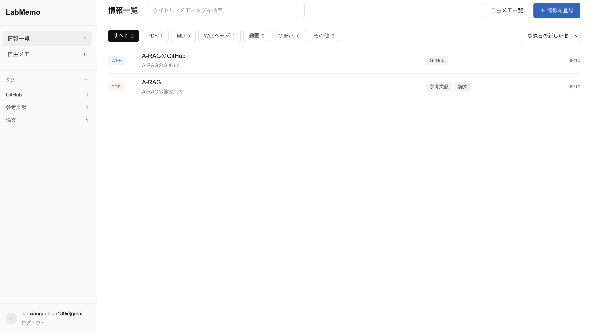
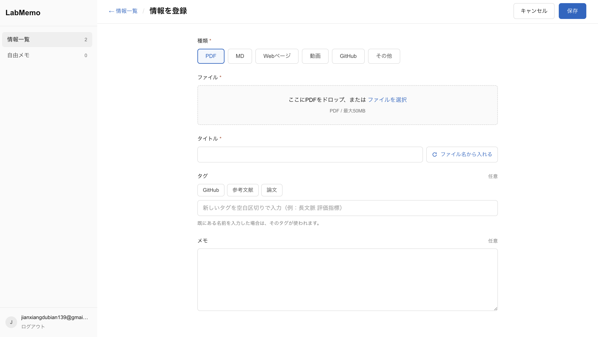
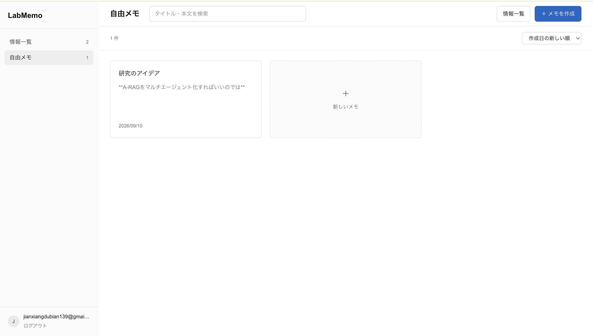
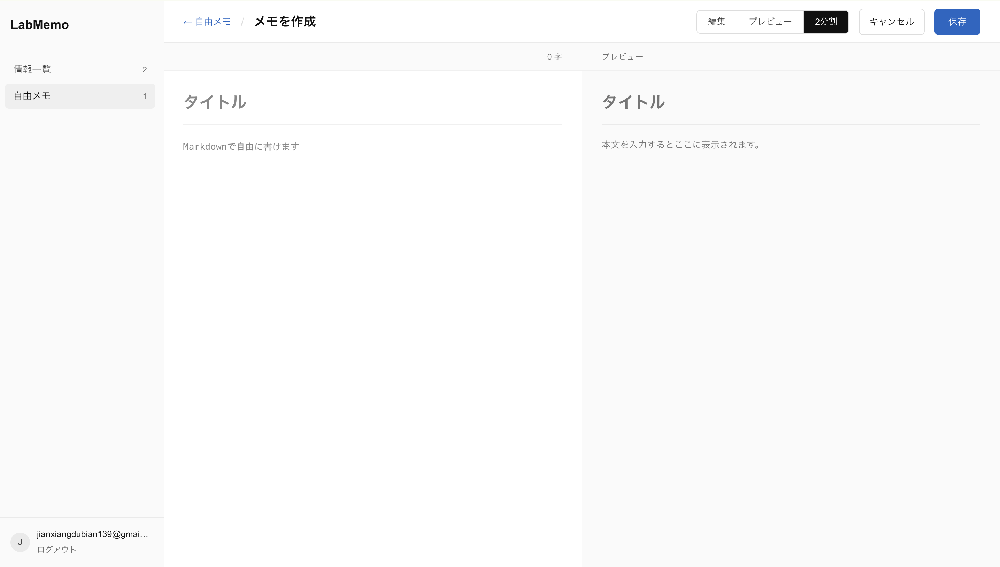
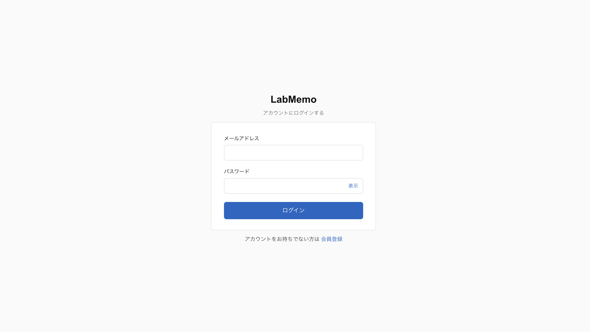
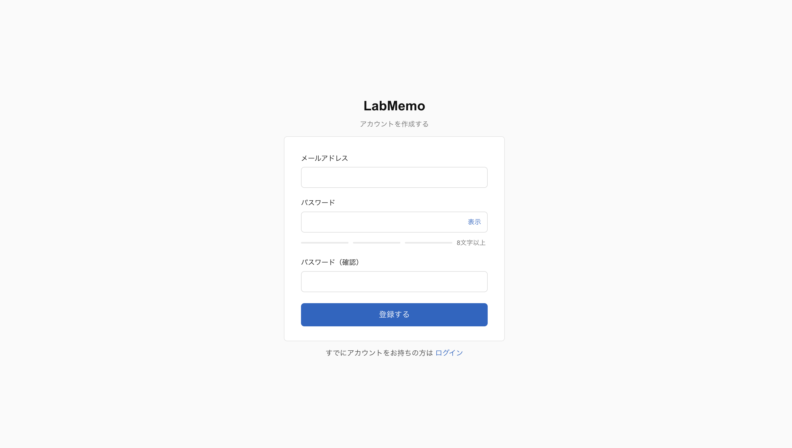
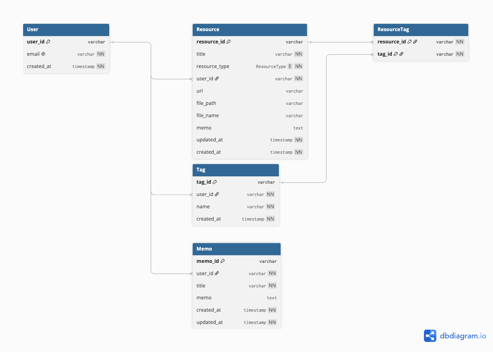

# LabMemo
LabMemoは研究時に参考にした論文やWebサイトなどを保存することができるサービスです．

## URL
https://lab-memo-pi.vercel.app/

## 目次
- [このサービスを作成したきっかけ](#このサービスを作成したきっかけ)
- [機能一覧](#機能一覧)
- [使用技術](#使用技術)
- [ER図](#er図)

## このサービスを作成したきっかけ
私は現在，修士１年で研究を行っています．
研究を行なっていると，関連研究の調査のためにたくさんの論文を読む必要があります．しかし，読んだ論文を後で見返す際に，どこにあるのかやどんなURLだったかなどを思い出すのがとても大変だったという経験がありました．
そこで，これまでに参考にした論文やWebサイトなどをまとめて管理することができるサービスがあれば嬉しいと考え，このサービスを作成しました．

## 機能一覧

| メイン画面(情報一覧) | 情報登録 |
| ---- | ---- |
|  |  |
| 登録した情報を一覧で確認でき，タグによる絞り込みや情報の種類に応じた表示の切り替えが可能です．さらに，キーワード検索やソート機能も備えています． | 情報の種類を選んで，ファイルのアップロードやURLを登録できます．また，タグの作成もできます． |

| 自由メモ一覧 | 自由メモ作成 |
| ---- | ---- |
|  |  |
| 作成した自由メモを確認することができます．ソート機能も備えています． | Markdown（MD）形式に対応しており，自由なレイアウトでメモを作成できます．編集画面とプレビュー画面の切り替えはもちろん，双方を同時に確認できる2分割表示にも対応しています． |

| ログイン | 会員登録画面 |
| ---- | ---- |
|  |  |
| メールアドレスとパスワードにより，ログインができます． | メールアドレスとパスワードを登録して会員登録ができます．メールアドレス認証もあります． |

## 使用技術

### フロントエンド
- TypeScript 5
- Next.js 16.3.0
- React 19.2.8
- react-markdown 10.1.0
- remark-gfm 4.0.1
- Tailwind CSS 4

### バックエンド
- Next.js Server Actions
- Prisma 7.9.1
- PostgreSQL
- Node.js 22.17.0

### インフラ・外部サービス
- Vercel
- Supabase Auth
- Supabase Storage
- Supabase (PostgreSQL)

### 開発環境
- ESLint 9
- Git / GitHub

## ER図
